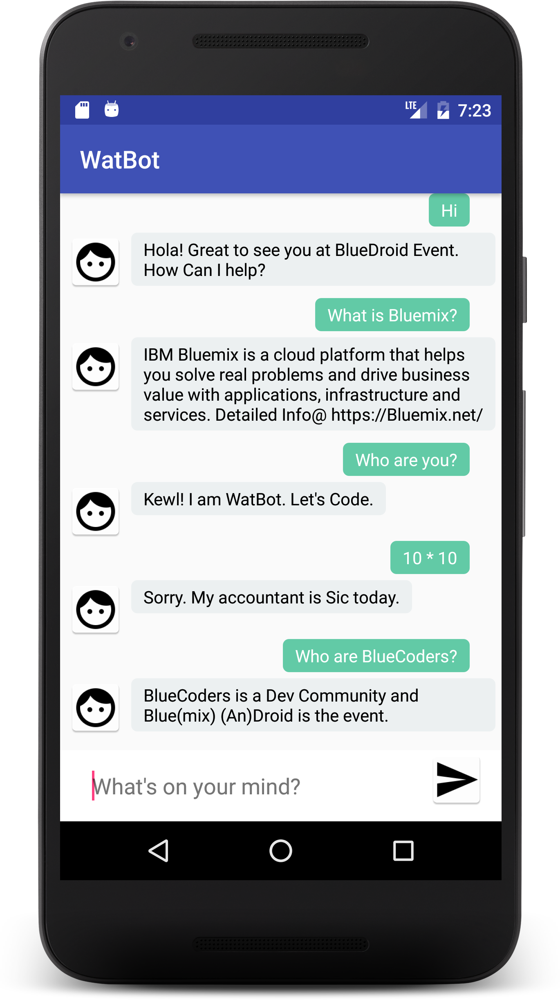

# WatBot - An Android ChatBot powered by IBM Watson

[](https://travis-ci.org/IBM-Bluemix/chatbot-watson-android)

WatBot is an IBM Watson powered ChatBot running on Android and using Conversation, Text-to-Speech, Speech-to-Text Services on IBM Bluemix (an open standards, cloud platform for building, running, and managing apps and services).
<p align="center"></p>

<h2>Coding the app on Android Studio</h2>
Android Studio is the Official IDE for Android. Android Studio provides the fastest tools for building apps on every type of Android device.

Clone the repo and import the code in Android Studio,

```
git clone https://github.com/IBM-Bluemix/chatbot-watson-android.git
```
## Config.xml 

Navigate to file app/src/main/res/values/config.xml and provide Bluemix service credentials 

```
<?xml version="1.0" encoding="utf-8"?>
<resources>
    <!-- Watson Conversation Service Credentials -->

    <string name="workspace_id"></string>

    <string name="conversation_username"></string>

    <string name="conversation_password"></string>



    <!--Watson Speech-To-Text Service Credentials-->

    <string name="STT_username"></string>

    <string name="STT_password"></string>



    <!--Watson Text-To-Speech Service Credentials-->

    <string name="TTS_username"></string>

    <string name="TTS_password"></string>



    <!--Bluemix Mobile Analytics-->

    <string name="mobileanalytics_apikey"></string>
</resources>
```

## Creation of Conversation Service

Watson Conversation combines a number of cognitive techniques to help you build and train a bot - defining intents and entities and crafting dialog to simulate conversation.


<h3>Getting started</h3>
Before you can start using the Conversation service, log in to IBM® Bluemix® and create a service instance.
<ol>
 	<li>Log in to Bluemix and navigate to the Conversation service:
<ul>
 	<li>Don’t have Bluemix account? <a title="(Opens in a new tab or window)" href="https://console.ng.bluemix.net/registration/?target=/catalog/services/conversation/" target="_blank">Sign up</a> to create a free trial account.</li>
 	<li>Have a Bluemix account? Use <a title="(Opens in a new tab or window)" href="https://console.ng.bluemix.net/catalog/services/conversation" target="_blank">this link</a>.</li>
</ul>
</li>
 	<li>In the <strong>Service name</strong> field, type a unique name for your new instance of the Conversation service.
Check the “Pricing Plans” for data limits for the Conversation service</li>
 	<li>Click <strong>Create</strong>. You’ll see details about your new instance in the “Service Details” page.</li>
</ol>


<h3>Creating a Workspace</h3>
You use the Conversation tool to create workspaces by either creating a new workspace from scratch, or  by importing a workspace from a [JSON](https://github.com/IBM-Bluemix/chatbot-watson-android/blob/master/sample.json) file. You can also duplicate an existing workspace within the same service instance.
<ol>
 	<li>If the Service Details page is not already open, click your Conversation service instance on the Bluemix console. (When you create a service instance, the Service Details page displays.)</li>
 	<li>On the “Service Details” page, scroll down to <strong>Conversation tooling</strong> and click <strong>Launch tool</strong>.</li>
 	<li>Click <strong>Create</strong> to create a new workspace.</li>
 	<li>Specify the details for the new workspace:
<ul>
 	<li><strong>Name</strong>: A name no more than 64 characters in length. This value is required.</li>
 	<li><strong>Description</strong>: A description no more than 128 characters in length.</li>
 	<li><strong>Language</strong>: The language of the user input the workspace will be trained to understand. The service supports Brazilian Portuguese, English, French, Italian, and Spanish.</li>
</ul>
</li>
 	<li>Click <strong>Create</strong>. The new workspace is created and now appears as a tile on the Workspaces page.</li>
</ol>
<h3>Creating an intent</h3>
You use the Conversation tool to create intents. The number of intents and examples you can create in a single service instance depends on your Conversation service plan:

Create some intents.
<ol>
 	<li>In the Conversation tool, open your workspace and then click the <strong>Intents</strong> tab.</li>
 	<li>Click <strong>Create new</strong>.</li>
 	<li>In the Intent name field, type a descriptive name for the intent. The intent name can contain letters (in Unicode), numbers, underscores, hyphens, and dots. Intent names cannot contain spaces and must not exceed 128 characters. The following are examples of intent names:
<ul>
 	<li><code>#weather_conditions</code></li>
 	<li><code>#pay_bill</code></li>
 	<li><code>#escalate_to_agent</code></li>
</ul>
<strong>Tip</strong>: Don’t include the <code>#</code> character in the intent names when you create them in the Conversation tool.</li>
 	<li>In the <strong>User example</strong> field, type the text of a user example for the intent. An example can be any string up to 1024 characters in length. The following might be examples for the <code>#pay_bill</code> intent:
<ul>
 	<li><code>I need to pay my bill.</code></li>
 	<li><code>Pay my account balance</code></li>
 	<li><code>make a payment</code></li>
</ul>
<strong>Important</strong>: Intent names and example text can be exposed in URLs when an application interacts with the service. Do not include sensitive or personal information in these artifacts.

Press Enter or click <strong>+</strong> to save the example.</li>
 	<li>Repeat the same process to add more examples. Provide at least 5 examples for each intent. The more examples you provide, the more accurate your application can be.
<p align="center"></p>
</li>
 	<li>When you have finished adding examples, click <strong>Create</strong> to finish creating the intent.</li>
</ol>
<h3>Results</h3>
The intent you created is added to the Intents tab, and the system begins to train itself on the new data.

You can click any intent in the list to open it for editing. You can make the following changes:
<ul>
 	<li>Rename the intent.</li>
 	<li>Delete the intent.</li>
 	<li>Add, edit, or delete examples.</li>
 	<li>Move an example to a different intent.</li>
</ul>
To move an example, select the example by clicking the check box and then click <strong>Move to</strong>.
<p align="center"></p>

<h3>Testing your intents</h3>
After you have finished creating new intents, you can test the system to see if it recognizes your intents as you expect.
<ol>
 	<li>In the Conversation tool, click the  icon.</li>
 	<li>In the Try it out panel, enter a question or other text string and press Enter to see which intent is recognized. If the wrong intent is recognized, you can improve your model by adding this text as an example to the correct intent.<strong>Tip</strong>: If you have recently made changes in your workspace, you might see a message indicating that the system is still retraining. If you see this message, wait until training completes before testing:
<p align="center"></p>
The response indicates which intent was recognized from your input.
<p align="center"></p>
</li>
 	<li>If the system did not recognize the correct intent, you can correct it. To correct the recognized intent, click the displayed intent and then select the correct intent from the list. After your correction is submitted, the system automatically retrains itself to incorporate the new data.
<p align="center"></p>
If your intents are not being correctly recognized, consider making the following kinds of changes:
<ul>
 	<li>Add the unrecognized text as an example to the correct intent.</li>
 	<li>Move existing examples from one intent to another.</li>
 	<li>Consider whether your intents are too similar, and redefine them as appropriate.</li>
</ul>
</li>
</ol>
<h3>Creating an entity</h3>
You use the Conversation tool to create entities. The number of entities, entity values, and synonyms you can create in a single service instance depends on your Conversation service plan:
<ol>
 	<li>In the Conversation tool, open your workspace and then click the <strong>Entities</strong> tab.</li>
 	<li>Click <strong>Create new</strong>.</li>
 	<li>In the <strong>Add the entity name</strong> field, type a descriptive name for the entity.The entity name can contain letters (in Unicode), numbers, underscores, and hyphens. For example:
<ul>
 	<li><code>@location</code></li>
 	<li><code>@menu_item</code></li>
 	<li><code>@product</code></li>
</ul>
<strong>Tips</strong>:
<ul>
 	<li>Don’t include the <code>@</code> character in the entity names when you create them in the Conversation tool.</li>
 	<li>Entity names can’t contain spaces or be longer than 64 characters. And entity names can’t begin with the string <code>sys-</code>, which is reserved for system entities.</li>
</ul>
</li>
 	<li>In the <strong>Value</strong> field, type the text of a possible value for the intent. An entity value can be any string up to 64 characters in length.<strong>Important</strong>: Don’t include sensitive or personal information in entity names or values. The names and values can be exposed in URLs in an app.</li>
 	<li>In the <strong>Synonyms</strong> field, type any synonyms for the entity value. A synonym can be any string up to 64 characters in length. Press Enter to save each synonym.</li>
 	<li>Click <strong>+</strong> and repeat the process to add more entity values.</li>
 	<li>When you are finished adding values and synonyms, click <strong>Create</strong>.</li>
</ol>
<h3>Building a Dialog</h3>
The dialog component of the Conversation service uses the intents and entities that are identified in the user’s input to gather required information and provide a useful response. Your dialog is represented graphically as a tree; create a branch to process each intent that you define.

Post branching Intents and entities, this is how my Conversation Dialog on Bluemix looks like


## Configure the App

  <p>To configure  the App you need to get the Watson Conversation service <strong>Username</strong>, <strong>PassWord</strong> and <strong>WorkSpaceId</strong></p>

* In the <strong>MainActivity</strong> class locate the method named <strong>sendMessage()</strong>.

   ```
     ConversationService service = new ConversationService(ConversationService.VERSION_DATE_2016_09_20);

     service.setUsernameAndPassword("Your Watson service UserName", "Your watson service PassWord");

     MessageRequest newMessage = new MessageRequest.Builder().inputText(inputmessage).build();

     MessageResponse response = service.message("Your Workspace Id", newMessage).execute();
   ```

* Go to the Conversation service , and select the <strong>Service Credentials</strong> tab. Select <strong>password</strong> and <strong>username</strong>.


 </p>Add the `password` and `username` in config.xml ,</p>

 ```
 service.setUsernameAndPassword("Your Watson service UserName", "Your watson service PassWord");

 ```

* Next is to get the <strong>workspace Id</strong>.

<p>Launch the conversation service workspace and from the options select the <strong>View details</strong>.</p>

<p align="center">
 

</p>

<p>Get the <strong>Workspace ID:</strong> and add it in config.xml,</p>

```
MessageResponse response = service.message("Your Workspace Id", newMessage).execute();
```

* Build and Run your app.

## Enable Text to Speech 

* Create a Watson Text to Speech(TTS) service on [Bluemix](https://console.ng.bluemix.net/catalog/services/text-to-speech/?taxonomyNavigation=apps) 
* Navigate to Service Credentials tab and click on "View Credentials".
* Add the credentials to config.xml
* Build and Run your app.

Now when you TAP on any message, the text will be heard via a Voice (Voice.EN_LISA). You can change the voice formats in the code (Lines 82-84 0f MainActivity.java)

<strong>Note: </strong> The required gradle entries for TTS is already included in the build.gradle file 
```
compile 'com.ibm.watson.developer_cloud:text-to-speech:3.5.3'
compile 'com.ibm.watson.developer_cloud:android-sdk:0.2.3'
```
## Enable Speech to Text

* Create a Watson Speech-To-Text (STT) service on [Bluemix](https://console.ng.bluemix.net/catalog/services/speech-to-text/?taxonomyNavigation=apps) 
* Navigate to Service Credentials tab and click on "View Credentials".
* Add the credentials to config.xml
* Build and Run your app.

<strong>Note: </strong> The required gradle entries for STT is already included in the build.gradle file 
```
compile 'com.ibm.watson.developer_cloud:speech-to-text:3.5.3'
compile 'com.ibm.watson.developer_cloud:android-sdk:0.2.3'
compile 'com.squareup.okhttp3:okhttp-ws:3.4.2'
```
## Mobile Analytics 

* Create a [Mobile Analytics](https://console.ng.bluemix.net/catalog/services/mobile-analytics/?taxonomyNavigation=apps) service on Bluemix.
* Click on Service Credentials tab and add the apikey to config.xml.
* Add the below entry to build.gradle(module:app) under dependencies
```
compile 'com.ibm.mobilefirstplatform.clientsdk.android:analytics:1.+'
```
* Add the below code to MainActivity.Java
```
//Bluemix Mobile Analytics
        BMSClient.getInstance().initialize(getApplicationContext(), BMSClient.REGION_US_SOUTH);
        //Analytics is configured to record lifecycle events.
        Analytics.init(getApplication(), "WatBot", analytics_APIKEY, false, Analytics.DeviceEvent.ALL);
        //Analytics.send();
        myLogger = Logger.getLogger("myLogger");
        // Send recorded usage analytics to the Mobile Analytics Service
        Analytics.send(new ResponseListener() {
            @Override
            public void onSuccess(Response response) {
                // Handle Analytics send success here.
            }

            @Override
            public void onFailure(Response response, Throwable throwable, JSONObject jsonObject) {
                // Handle Analytics send failure here.
            }
        });

        // Send logs to the Mobile Analytics Service
        Logger.send(new ResponseListener() {
            @Override
            public void onSuccess(Response response) {
                // Handle Logger send success here.
            }

            @Override
            public void onFailure(Response response, Throwable throwable, JSONObject jsonObject) {
                // Handle Logger send failure here.
            }
        });
```

### Chat with your own WatBot 

If you have followed all the above instructions, you should be happily chatting with your Wat(son)Bot. 

** Remember your bot will be talking to your Conversation Service (Intents, Entities and Dialog).**

### Don't stop here!!! Keep coding and using Bluemix

## License

See [License.txt](https://github.com/IBM-Bluemix/chatbot-watson-android/blob/master/License.txt) for license information.
